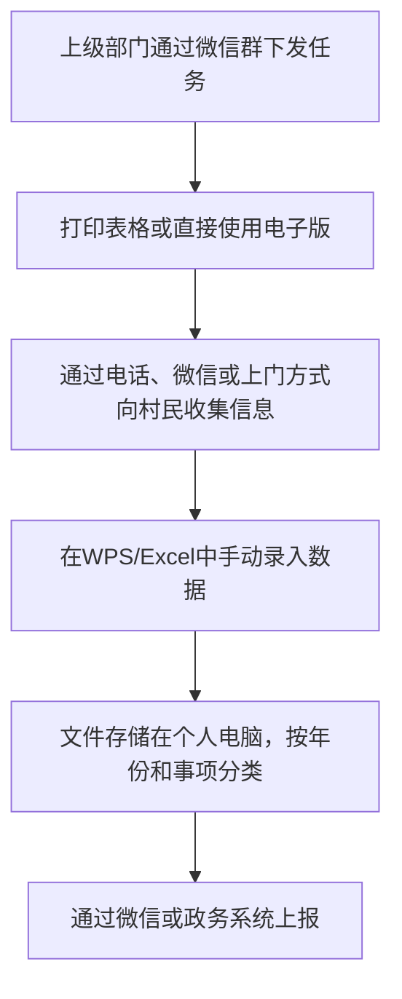
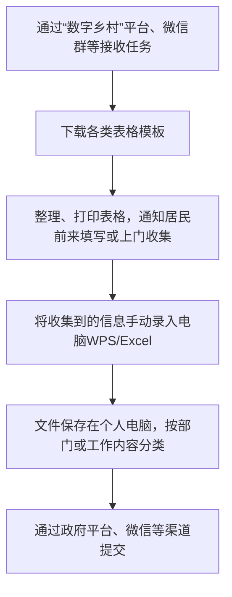
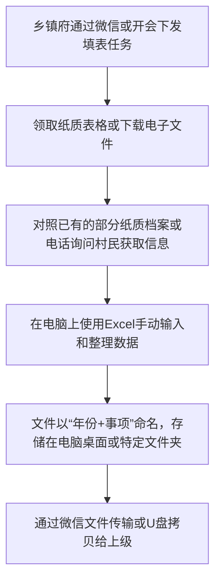
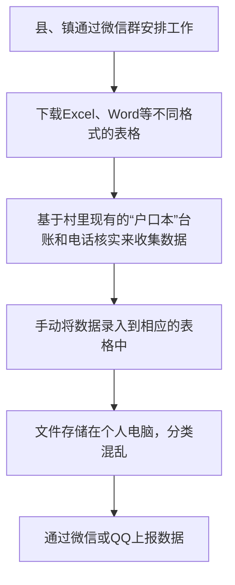
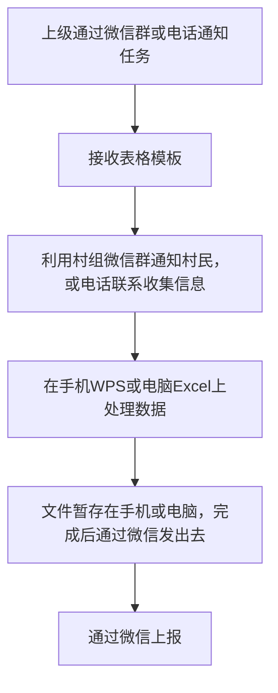
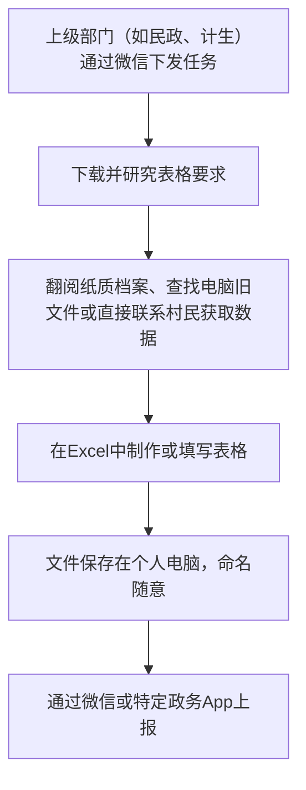
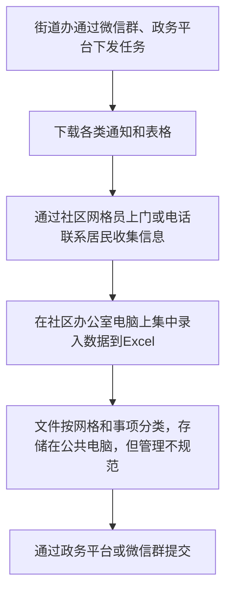
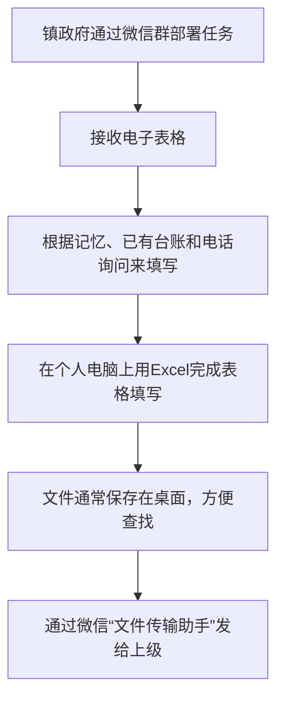

# 乡村信息化工作流程与痛点分析报告

## 1. 总体概述

通过对8个村庄（社区）的会议纪要和访谈记录进行分析，我们发现当前乡村信息化工作在处理信息和表格方面存在普遍性的流程和痛点。本报告旨在详细梳理这些流程，归纳核心痛点，并为后续的数字化工具设计提供具体、有针对性的改进方向。

### 1.1. 通用工作流程

尽管每个村庄的具体操作略有差异，但信息处理的整体流程基本一致，可以概括为以下四个主要环节：

1.  **数据采集**：主要通过上级部门的微信群、政府工作平台或纸质文件接收任务和表格模板。信息来源包括村民的身份证、户口本、电话访谈、上门走访等。
2.  **数据录入**：绝大部分工作依赖于WPS和Excel。工作人员需要手动将采集到的信息录入到电子表格中。对于纸质表格，需要进行二次录入。
3.  **数据存储**：完成的表格文件通常存储在工作人员的个人电脑或手机中，缺乏统一、安全的存储和备份机制。文件命名和归档方式较为随意，依赖个人习惯。
4.  **数据共享与上报**：主要通过微信、QQ、电子政务平台或电子邮件向上级部门提交完成的表格。

### 1.2. 核心痛点总结

在上述流程中，乡村工作人员普遍面临以下几大痛点：

*   **重复录入，负担沉重**：这是最核心的痛点。村民的基础信息（如姓名、身份证号、家庭住址、联系方式等）需要在不同的表格中反复手动录入，耗费大量时间和精力，且容易出错。
*   **格式不兼容，整合困难**：来自不同部门的表格格式（Word, Excel, PDF）和字段要求各不相同，导致数据难以直接复用和整合。工作人员需要花费额外时间调整格式。
*   **数据不同步，一致性差**：由于数据分散存储在个人设备上，缺乏统一的数据源，导致同一村民的信息在不同表格、不同时间点可能存在差异，数据一致性难以保证。
*   **操作复杂，效率低下**：部分政府系统操作复杂，学习成本高。频繁在不同软件（微信、WPS/Excel、政务平台）之间切换，也降低了工作效率。
*   **数据检索困难，利用率低**：历史数据查找困难，需要在一堆杂乱的文件中手动搜索。数据的价值未能得到有效利用，基本停留在“填完就报”的层面。
*   **数据安全与隐私风险**：将含有村民隐私的敏感信息存储在个人电脑和手机上，并通过微信等社交工具传输，存在数据泄露的安全隐患。

## 2. 各村庄（社区）详细分析

以下是根据会议纪要对每个村庄（社区）的具体分析。

---

### 2.1. 曾书记所在村

**信息化工作流程:**

**主要痛点:**

*   **重复性工作**：大量表格需要填写相同的基础信息，例如贫困户、残疾人、老年人等群体的花名册。
*   **数据核对困难**：上报数据前需要反复核对，担心出错，心理压力大。
*   **格式多样**：不同部门的表格格式不一，需要手动调整。
*   **历史数据查找难**：需要从电脑里众多文件中翻找特定信息。

---

### 2.2. 卧龙社区 (杨主任)

**信息化工作流程:**

**主要痛点:**

*   **表格海洋**：“上面千条线，下面一根针”，需要应对来自几十个部门的填表任务。
*   **信息孤岛**：不同系统、不同表格之间数据不互通，居民信息反复填。
*   **时效性要求高**：任务常常很紧急，需要加班加点完成。
*   **数据更新不及时**：居民信息（如电话、住址）发生变化，难以及时更新到所有相关表格中。

---

### 2.3. 金塘村

**信息化工作流程:**

**主要痛点:**

*   **基础数据重复填**：村民的基本信息是每次填表的“必修课”。
*   **纸质与电子并存**：部分历史资料是纸质的，需要时得翻箱倒柜，再手动录入电脑，工作量大。
*   **数据易丢失**：个人电脑存储，没有备份机制，存在文件损坏或丢失的风险。
*   **协作困难**：村干部之间共享数据不便，通常是各做各的。

---

### 2.4. 两重村

**信息化工作流程:**

**主要痛点:**

*   **数据来源不一**：需要整合来自不同台账、系统和口头询问的信息，容易出错。
*   **“表哥”“表姐”现象**：村里需要有专人负责大部分的填表工作，对其个人依赖度高。
*   **格式转换麻烦**：有时需要将Word表格转为Excel，或反之，操作繁琐。
*   **缺乏反馈**：上报数据后，很少得到关于数据质量或后续使用的反馈。

---

### 2.5. 彭小靖所在村

**信息化工作流程:**

**主要痛点:**

*   **移动办公不便**：虽然会用手机WPS，但在小屏幕上处理复杂表格，效率低且易出错。
*   **信息核实成本高**：对于需要精准的信息（如银行卡号），需要反复与村民电话沟通确认。
*   **数据“阅后即焚”**：填完报送后，这些数据文件很少被再次利用，成为一次性工作。
*   **版本管理混乱**：一个表格可能修改多次，微信传来传去，容易搞不清哪个是最终版。

---

### 2.6. 山川村 (罗桂凤)

**信息化工作流程:**

**主要痛点:**

*   **新老数据脱节**：纸质档案和电子数据并存，查找信息时需要两头翻。
*   **对特定人员依赖高**：熟悉情况的老村干一旦退休或离开，工作交接困难。
*   **系统繁多，账号密码记不住**：需要登录多个不同的政府系统，每个系统操作逻辑还不一样。
*   **网络问题**：在网络信号不好的地方，使用在线政务系统上报数据会很困难。

---

### 2.7. 同花社区 (邓天宇)

**信息化工作流程:**

**主要痛点:**

*   **数据保密性担忧**：居民对提供身份证号等敏感信息存在顾虑。
*   **人员流动影响**：社区工作人员、网格员流动性较大，工作交接时数据容易丢失或混乱。
*   **多部门任务冲突**：同一时间可能收到多个部门的紧急填表任务，应接不暇。
*   **统计汇总繁琐**：需要手动从多个表格中筛选、汇总数据，制作统计报表，工作量大。

---

### 2.8. 周代年所在村

**信息化工作流程:**

**主要痛点:**

*   **信息准确性难保证**：部分信息依赖个人记忆，可能不准确或过时。
*   **“一个数据，N个婆家”**：同一个数据可能需要报送给不同部门，口径和要求还可能不一致。
*   **缺乏技术支持**：遇到电脑或软件问题时，只能靠自己摸索或求助身边的人。
*   **工作留痕难**：通过微信传输文件，过程零散，不便于工作的追溯和管理。

---
*注意：因“贺书记表格调研.txt”文件无法访问，故缺少对该村的分析。*